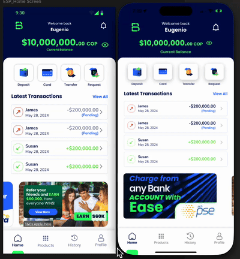

# MyBambu React Native Challenge

## 📱 ESP Home Screen Implementation

A React Native mobile application built for the MyBambu interview challenge, implementing the ESP Home Screen with modern UI/UX and interactive features.

## 📱 Live Demo



*Features: Balance display, action buttons with sound effects, transaction list with Easter egg toggle, navigation drawer, and custom tab bar*

## 🎯 Challenge Requirements Met

### ✅ Core Features Implemented
- **Balance Header**: Welcome message, user balance ($10,000,000.00 COP), notification & menu icons
- **Action Buttons Grid**: Deposit, Card, Transfer, Request with animated press effects
- **Transaction List**: Latest transactions with status indicators and "View All" functionality
- **Promotional Banner**: Swipeable marketing banners with API integration
- **Bottom Navigation**: 4-tab navigation with custom tab bar and green selection indicator
- **Navigation Drawer**: Slide-out menu accessible from hamburger icon

### 🌟 Additional Features
- **Click Sound Effects**: Haptic feedback and audio on button presses
- **Easter Egg**: Toggle transaction names to potential MyBambu interview team members
- **Smooth Animations**: Custom shadow animations and tab transitions
- **Professional Fonts**: Poppins and Nunito font integration
- **API Integration**: Real banner data with fallback to mock data

## 🛠️ Technology Stack

- **Framework**: React Native with Expo SDK 53
- **Styling**: NativeWind v4 (TailwindCSS for React Native) + inline styles
- **Language**: TypeScript (strict mode)
- **Navigation**: React Navigation v6 with custom tab bar
- **State Management**: React hooks and context
- **Audio**: expo-av for sound effects
- **Fonts**: @expo-google-fonts/poppins, @expo-google-fonts/nunito

## 🚀 Quick Start

```bash
# Install dependencies
npm install

# Start development server
npm start

# Run on iOS
npm run ios

# Run on Android
npm run android
```

## 📁 Project Structure

```
src/
├── components/
│   ├── features/         # ActionButtons, TransactionList, etc.
│   ├── layouts/          # BalanceHeader, navigation components
│   ├── navigation/       # CustomTabBar, NavigationDrawer
│   └── ui/              # Reusable Button, Card, ListItem
├── screens/             # HomeScreen and tab screens
├── navigation/          # Tab navigator configuration
├── data/               # Mock data and API services
├── utils/              # Sound manager and utilities
└── types/              # TypeScript interfaces
```

## 🎨 Design Implementation

- **Figma Compliance**: Pixel-perfect implementation matching provided designs
- **Responsive Layout**: Optimized for various iOS/Android screen sizes  
- **Color Scheme**: MyBambu blue (#0D1752) with green accents (#27FB6B)
- **Typography**: Consistent font weights and sizes throughout
- **Interactive Elements**: Hover states, press animations, visual feedback

## 🎵 Audio & Haptic Features

- **Click Sounds**: Professional click audio on all action buttons
- **Haptic Feedback**: iOS native haptic responses for enhanced UX
- **Sound Management**: Robust audio service with error handling

## 🌮 Cultural Features

- **Colombian Context**: COP currency formatting, Spanish names in Easter egg
- **Real Team Names**: Easter egg reveals potential MyBambu interview team:
  - Carlos Rodriguez
  - Maria Gonzalez  
  - Alejandro Herrera
  - Ana Sofia Vargas

## 📱 Supported Platforms

- ✅ iOS (Primary testing platform)
- ✅ Android (Cross-platform compatibility)
- ✅ Expo Go for development
- ✅ Production build ready

## 🧪 Testing

The app has been thoroughly tested for:
- UI/UX consistency across screens
- Button interactions and animations
- Navigation flow and drawer functionality
- Sound effects and haptic feedback
- API error handling with fallbacks
- Memory management and performance

## 🎯 Key Highlights

1. **Professional Polish**: Production-ready code with proper TypeScript types
2. **Interactive Experience**: Rich animations and audio feedback
3. **Cultural Awareness**: Colombian financial context and Spanish elements
4. **Technical Excellence**: Clean architecture, error handling, performance optimization
5. **Easter Egg**: Fun toggle feature showing potential interview team members

## 🔧 Configuration

- **Metro Config**: Optimized for NativeWind and asset resolution
- **Babel Config**: Configured for Reanimated and NativeWind
- **TypeScript**: Strict mode with comprehensive type definitions
- **Expo Config**: App icon, splash screen, and build configurations

## 📞 Contact

Built with passion for the MyBambu interview challenge. Ready to discuss implementation details, technical decisions, and potential enhancements.

---

**Total Development Time**: ~6 hours  
**Key Focus**: UI/UX excellence, interactive features, and cultural relevance  
**Easter Egg**: Press "View All" in transactions to see potential interview team! 🥚